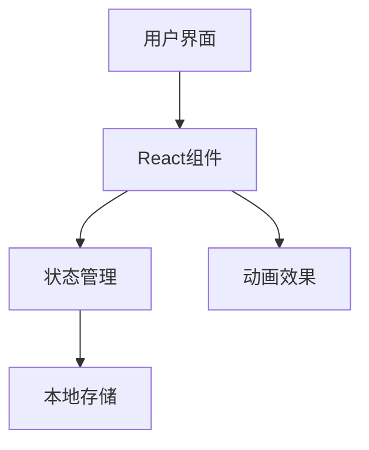
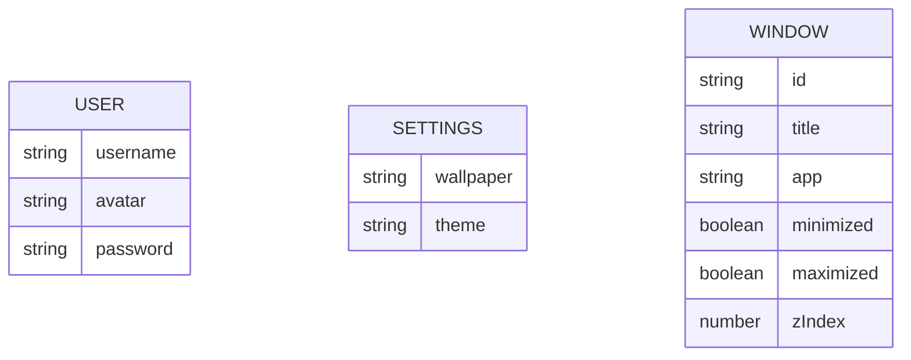

## 1. Architecture Design
纯前端应用，使用React构建，包含完整的状态管理和组件化设计。

## 2. Technology Description
- 前端: React@18 + TypeScript + tailwindcss@3 + vite
- 初始化工具: vite-init
- 后端: 无
- 数据库: 本地存储 (localStorage)

## 3. Route Definitions
| Route | Purpose |
|-------|---------|
| / | 主入口，根据状态显示不同界面 |

## 4. API Definitions
无后端API

## 5. Server Architecture Diagram
无后端服务器

## 6. Data Model
### 6.1 Data Model Definition

### 6.2 Data Definition Language
使用本地存储存储用户状态和设置
