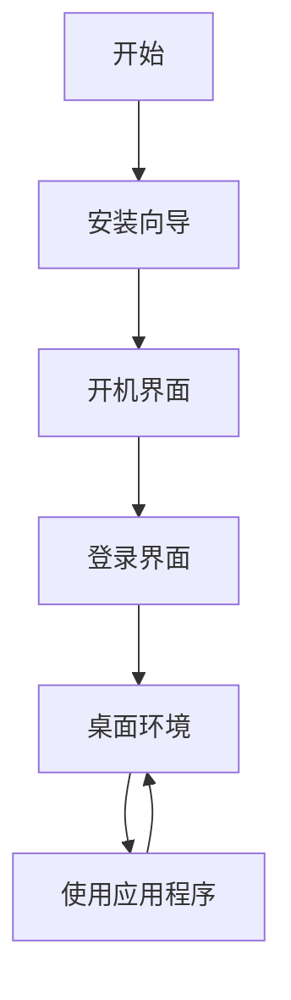

## 1. Product Overview
Windows 12网页版模拟器 - 一个交互式的Windows 12界面模拟，包含完整的安装过程、开机动画、登录界面、桌面环境和可互动的应用程序。
- 主要功能：模拟Windows 12的完整用户体验，从安装到日常使用
- 目标用户：想要体验Windows 12界面的用户，或者用于展示目的

## 2. Core Features

### 2.1 User Roles
| Role | Registration Method | Core Permissions |
|------|---------------------|------------------|
| Guest | 无需注册 | 使用所有模拟功能 |

### 2.2 Feature Module
1. **安装向导**: 模拟Windows 12的安装过程
2. **开机界面**: 包含品牌标志和加载动画
3. **登录界面**: 用户账户登录界面
4. **桌面环境**: 完整的桌面界面，包含任务栏、开始菜单、桌面图标
5. **可互动应用**: 文件资源管理器、浏览器、设置等应用程序

### 2.3 Page Details
| Page Name | Module Name | Feature description |
|-----------|-------------|---------------------|
| 安装向导 | 步骤导航 | 多步骤安装流程，包含语言选择、许可协议、安装进度 |
| 开机界面 | 品牌展示 | Windows 12 logo动画，加载进度条 |
| 登录界面 | 用户登录 | 用户头像、密码输入、登录按钮 |
| 桌面环境 | 桌面UI | 壁纸、桌面图标、任务栏、开始菜单 |
| 应用程序 | 窗口管理 | 可拖动、最小化、最大化、关闭的窗口 |

## 3. Core Process
用户打开页面 → 进入安装向导 → 完成安装 → 显示开机界面 → 进入登录界面 → 登录后进入桌面 → 可以打开和使用各种应用程序

## 4. User Interface Design
### 4.1 Design Style
- 主色调：蓝色系（#0078D4），配合浅灰和白色
- 按钮风格：圆角矩形，扁平化设计
- 字体：Segoe UI，现代无衬线字体
- 布局风格：卡片式布局，简洁现代
- 图标风格：扁平化，圆角设计

### 4.2 Page Design Overview
| Page Name | Module Name | UI Elements |
|-----------|-------------|-------------|
| 安装向导 | 步骤容器 | 淡蓝色背景，居中卡片，步骤指示器 |
| 开机界面 | 全屏背景 | 深色背景，居中logo动画，底部进度条 |
| 登录界面 | 登录卡片 | 半透明背景，用户头像，输入框，登录按钮 |
| 桌面环境 | 完整桌面 | 壁纸，桌面图标，底部任务栏，开始菜单 |
| 应用窗口 | 窗口框架 | 标题栏，窗口内容，控制按钮 |

### 4.3 Responsiveness
桌面优先设计，适配不同屏幕尺寸，触摸优化

### 4.4 3D Scene Guidance
不适用
